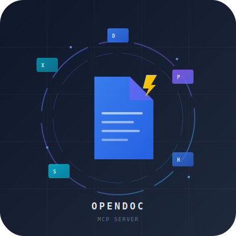

# opendoc-mcp

<p align="center">
  
</p>

**High-performance Rust MCP server for document CRUD operations — purpose-built for AI agents.**

`opendoc-mcp` is a pure-Rust implementation of the [Model Context Protocol (MCP)](https://modelcontextprotocol.io/) server that gives AI assistants (Claude, ChatGPT, Cursor, VS Code, etc.) direct, native access to create, read, edit, convert, and manage Office documents and PDFs — **without external dependencies, LibreOffice, cloud APIs, or heavy runtimes**.

```text
One binary. Zero deps. All formats. Lightning fast.
```

---

## Features

### Supported Formats

| Format | Create | Read | Edit | Convert To |
|--------|--------|------|------|------------|
| **DOCX** | ✅ | ✅ | ✅ | PDF, Markdown, HTML, JSON |
| **PPTX** | ✅ | ✅ | ✅ | Markdown, JSON |
| **PDF** | ✅ | ✅ | ✅ | Text extraction, JSON |
| **XLSX** | ✅ | ✅ | — | CSV, JSON |
| **HTML** | ✅ | ✅ | — | JSON |
| **Markdown** | — | ✅ | — | JSON |
| **CSV** | — | ✅ | — | JSON |
| **TXT** | — | ✅ | — | JSON |

### Unified Tools & Capabilities

**Document Intelligence**
- `open_document` — Open any document and return structured JSON (takes `detail_level`: `full`, `summary`, `metadata_only`)
- `read_document_text` — Extract plain text from any document
- `search_document` — Find keywords or regex matches
- `replace_text` — Regex-powered text replacement (operates on IR)
- `diff_documents` — LCS paragraph-level document comparison
- `chunk_for_embedding` — Text chunking for RAG / embeddings
- `fill_template` — Template variable substitution (takes raw JSON `variables` object)
- `validate_document` — Inspect document structural soundness

**Format Conversion**
- `convert` — Cross-format conversion (DOCX↔PDF, DOCX→MD, XLS→CSV, etc.)
- `create_html` — Convert document to styled HTML

**Batch Processing**
- `batch_convert` — Parallel conversion of a whole directory of documents

**Authoring & Editing**
- **DOCX**: `create_docx`, `docx_add_paragraph`, `docx_add_table`, `docx_add_image`
- **PPTX**: `create_pptx`, `pptx_add_slide`
- **XLSX**: `create_xlsx` (takes raw JSON `sheets` array)
- **PDF**: `create_pdf`, `merge_pdfs`, `extract_pdf_text`, `list_pdf_fields`, `fill_pdf_form` (takes raw JSON `values` object)

**Metadata & Analysis**
- `find_tables` — Extract table coordinates and metadata
- `analyze_document_complexity` — Complexity analysis (OCR needs, page scans)

**AI Features**
- `ocr_document` — Feature-gated OCR for scanned docs (requires `--features ocr`)
- `check_ocr_available` — Check OCR engine status

**Utility**
- `list_capabilities` — Category list of all consolidated tools

---

## MCP Resources

`opendoc-mcp` exposes documents directly as read-only MCP resources:
- `doc://{absolute_path}` — Exposes the plain text content of a document
- `doc://{absolute_path}/outline` — Exposes the JSON outline of a document (sections, heading hierarchy)

These can be read directly by agents without tool calls using standard resource read requests.

---

## Structured Errors ("Errors as Instructions")

All tool errors return structured JSON payloads to help AI agents recover dynamically:
```json
{
  "error": "Detailed description of the error...",
  "error_code": "FILE_IO_ERROR",
  "category": "io",
  "suggestion": "Verify the file exists at the specified path..."
}
```

---

## Quick Start

### Installation

```bash
cargo install opendoc-mcp
```

Or build from source:

```bash
git clone https://github.com/yourusername/opendoc-mcp.git
cd opendoc-mcp
cargo build --release
./target/release/opendoc-mcp
```

### Configuration

#### Claude Desktop

Add to your `claude_desktop_config.json`:

```json
{
  "mcpServers": {
    "opendoc-mcp": {
      "command": "/path/to/opendoc-mcp"
    }
  }
}
```

#### VS Code (Cline / Roo Code)

Add to your MCP settings:

```json
{
  "servers": {
    "opendoc-mcp": {
      "command": "/path/to/opendoc-mcp"
    }
  }
}
```

#### Cursor

Configure in Cursor Settings → MCP Servers → Add:

```
Name: opendoc-mcp
Type: stdio
Command: /path/to/opendoc-mcp
```

---

## Performance

`opendoc-mcp` is designed for AI agent workloads where every millisecond counts:

| Metric | `opendoc-mcp` (Rust) | Node.js-based MCP | Python-based MCP |
|--------|---------------------|-------------------|-------------------|
| Binary size | ~5 MB | ~50 MB+ (with node_modules) | ~30 MB+ (with venv) |
| Startup time | < 10 ms | ~200-500 ms | ~300-800 ms |
| Memory (idle) | ~3-5 MB | ~30-50 MB | ~40-80 MB |
| DOCX read | ~2 ms | ~15 ms | ~25 ms |
| PDF merge (5 files) | ~8 ms | ~60 ms | ~100 ms |

---

## Architecture

```
┌─────────────────────────────────────────┐
│         MCP Client (Host)               │
│  Claude / Cursor / VS Code / Custom     │
└──────────────┬──────────────────────────┘
               │  JSON-RPC over stdio
               ▼
┌─────────────────────────────────────────┐
│         opendoc-mcp Server              │
│                                          │
│  ┌──────────┐  ┌──────────┐  ┌────────┐ │
│  │  DOCX    │  │  PPTX    │  │  PDF   │ │
│  │ Handler  │  │ Handler  │  │Handler │ │
│  └────┬─────┘  └────┬─────┘  └───┬────┘ │
│       │              │            │       │
│  ┌────┴──────────────┴────────────┴────┐  │
│  │         Rust Core (rmcp)            │  │
│  │  MCP Protocol · Transport · Tools   │  │
│  └─────────────────────────────────────┘  │
└─────────────────────────────────────────┘
```

**Key design decisions:**
- **Single binary** — No runtime dependencies, no npm/pip, no LibreOffice
- **Stdio transport** — Zero networking overhead, instant startup
- **Pure Rust** — Memory-safe, thread-safe, predictable performance
- **Modular handlers** — Each format is isolated; adding new formats is trivial

---

## Development

```bash
# Check compilation
cargo check

# Run tests
cargo test

# Build release
cargo build --release

# Run with logging
RUST_LOG=debug cargo run
```

### Project Structure

```
opendoc-mcp/
├── Cargo.toml
├── README.md
├── assets/           # Logos, branding
├── benches/          # Criterion benchmarks
├── docs/
│   ├── architecture.md
│   ├── changelog.md
│   ├── implementationplan.md
│   ├── spec.md
│   └── superpowers/  # Advanced usage guides
├── src/
│   ├── main.rs       # Entry point: MCP server or CLI
│   ├── lib.rs        # Module exports
│   ├── server.rs     # MCP #[tool] definitions
│   ├── cli.rs        # CLI subcommands (clap)
│   ├── ir/           # Internal Representation (Document, Paragraph, etc.)
│   ├── engine/       # search, replace, template, diff, complexity
│   ├── handlers/     # docx/pptx/pdf/xlsx/html/md/csv/pdf_forms
│   ├── converters/   # Cross-format conversion
│   ├── batch/        # Rayon-parallel batch processing
│   ├── validators/   # Document structure validation
│   ├── ocr/          # Feature-gated OCR (--features ocr)
│   └── security.rs   # Path validation sandbox
└── tests/
    └── common/       # Shared test utilities
```

---

## Roadmap

**v0.0.2 ✅** — IR engine, format expansion (XLSX, HTML, MD, CSV), batch processing, CLI, benchmarks, doc comments
**v0.0.3 ✅** — Enhanced template engine, multi-page PDF with layout, DOCX image insertion, 80%+ test coverage
**v0.0.4 🔄** — Text chunking for RAG, image extraction, PDF split by range, password support
**v0.1.0** — WASM target, digital signatures, document comparison, streaming
**v1.0.0** — Production-ready: full format coverage, enterprise security, OCR

See [docs/implementationplan.md](docs/implementationplan.md) for details.

---

## Why Rust for AI Agent Tools?

AI agents need tool servers that are:
- **Fast** — Sub-millisecond startup, no warm-up
- **Lightweight** — Minimal RAM/CPU so many can run in parallel
- **Reliable** — No garbage collection pauses, no runtime crashes
- **Portable** — Single binary for any platform (Linux, macOS, Windows)

Rust delivers all of this. Most document MCP servers today are Node.js or Python — `opendoc-mcp` is the first pure-Rust alternative.

---

## License

MIT License — see [LICENSE](LICENSE) for details.

---

## Contributing

Contributions welcome! Areas needing help:
- Multi-page PDF layout and rendering
- Template engine for document generation (nested objects, loops)
- DOCX image insertion
- WASM compilation target
- Additional format support (ODT, JSON)
